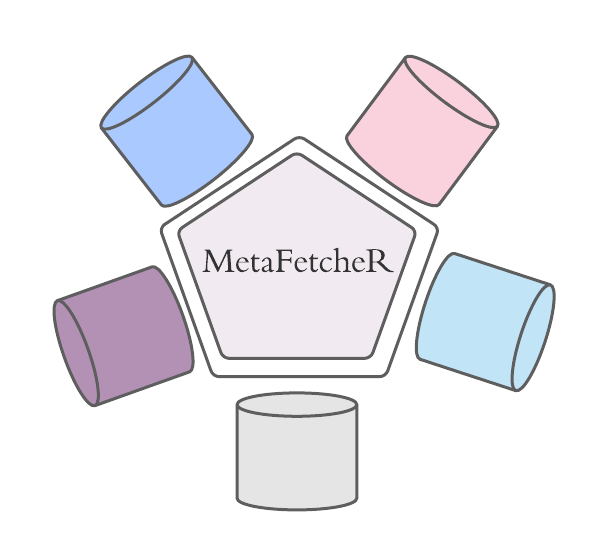

# MetafetcheR



***
An R package designed to link metabolites' IDs from different Metabolome databases with eachother in a step to resolve ambiguity and standardize metabolites representation and annotation.
Currently the package supports resolving IDs for the following databases:
  - Human Metabolome Database (HMDB)
  - Chemical Entities of Biological Interest (ChEBI)
  - PubChem
  - Kyoto Encyclopedia of Genes and Genomes (KEGG)
  - Lipidomics Gateway (LipidMaps)
 
  
 For any questions or issues please use the Issues in github or contact Rajmund Casombordi or Sara Younes.
 
 
MetafetcheR is implemented in R 
***
##  Installation

 ```R
devtools::install_github("komorowskilab/metafetcher")
```

*** 
See the [documentation](https://komorowskilab.github.io/metafetcher/).

## Authors
- Rajmund Casombordi 
  @oboforty
- Sara Yones sara.younes@icm.uu.se 
 @SaraYones
- Klev Diamanti 
 @klevdiamanti

